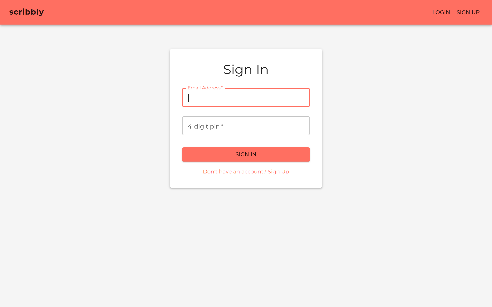
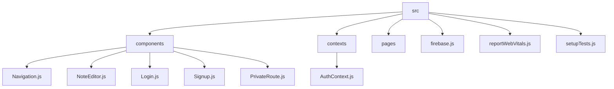

# Scribbly Web: A Note-Taking Web Application

## 🗂️ Description

Scribbly Web is a modern note-taking web application designed to help users organize their thoughts and ideas efficiently. This project is perfect for individuals who want a simple yet feature-rich platform to jot down notes, categorize them, and access them from anywhere. Scribbly Web utilizes React, Firebase, and Material UI to provide a seamless user experience.

The application allows users to create, edit, and delete notes, as well as categorize them using labels and pin important notes for easy access. It also features a rich text editor for note creation and supports dark mode for comfortable usage.

## ✨ Key Features

### 📝 Note Management

* Create, edit, and delete notes
* Categorize notes using labels
* Pin important notes for easy access

### 🔒 Authentication

* User authentication using Firebase Authentication
* Protected routes for authenticated users only

### 🎨 User Interface

* Responsive design for optimal viewing on various devices
* Dark mode support for comfortable usage
* Rich text editor for note creation

### ⚡️ Performance

* Optimized for fast loading and rendering
* Utilizes modern web technologies for a seamless experience

## 🗂️ Folder Structure

## 🛠️ Tech Stack

## ⚙️ Setup Instructions

To run the project locally, follow these steps:

* Git clone the repository: `https://github.com/Arijit-05/Scribbly_web.git`
* Install dependencies: `npm install`
* Start the development server: `npm start`
* Open your browser and navigate to `http://localhost:3000`

## 📁 GitHub Actions

The project uses GitHub Actions for continuous integration and deployment. The workflow is configured to:

* Run tests on push and pull requests
* Deploy the application to a hosting platform on successful builds

No additional configuration is required to set up GitHub Actions. The workflow is defined in the `.github/workflows` directory.

  

<h3>Arijit</h3>

Developer and coder passionate about innovative solutions.

 

  <a href="https://gitfull.vercel.app">Made by GitFull</a>

    